# Unity 通用Buff系统
该项目是一个通用的Buff系统，旨在帮助Unity开发者轻松实现游戏中的Buff效果。该系统能够轻松集成到现有项目，你可以方便地添加、管理和应用自定义逻辑的Buff。
[教程视频](www.bilibili.com/video/BV16e411H7Vx/)

## 特性
- 优秀的可拓展性：你可以根据游戏需求编写自定义逻辑的Buff
- 内置Buff编辑器：你可以在编辑器管理和配置你创建的Buff
- 简洁的接口和使用方法：系统提供了简单易用的API，使得添加和应用Buff变得简单明了。

## 支持与联系
- 邮箱：nosloofah@qq.com
- bilibili：NoSLoofah
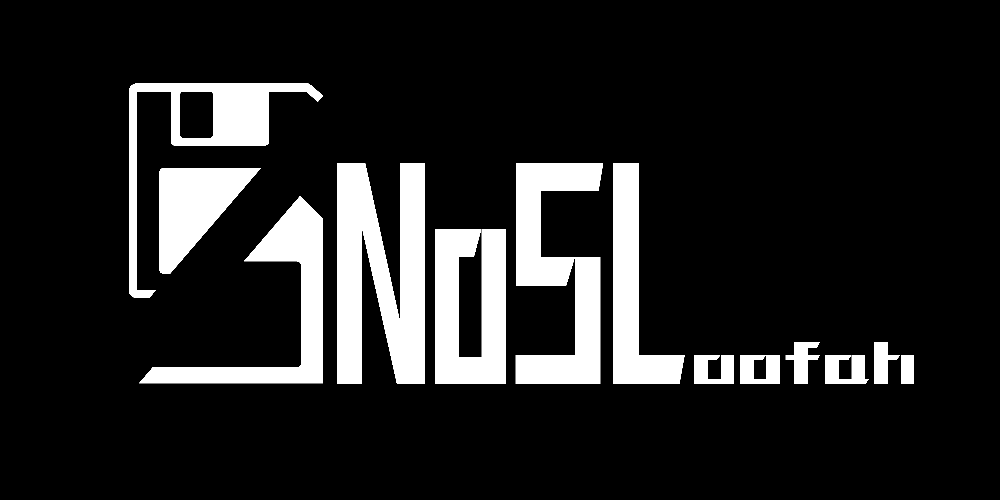

## 注意
1. NoSLoofah_BuffSystem/BuffSystem文件夹可以移动，但不要改变该文件夹内部的文件位置
2. 请保证项目中始终只有一个BuffMgr.prefab
3. 如果要重置所有数据，可以直接删除Assets/NoSLoofah_BuffSystem/BuffSystem/Data/BuffData文件夹。下次打开BuffEditor时该文件夹会重新生成

## 快速上手
### 安装
将Assets/NoSLoofah_BuffSystem/BuffSystem文件夹拷贝到你的项目

或导入Release中的unitypackage
### 打开编辑器和初始化
在Unity编辑器的工具栏打开Tools/BuffEditor
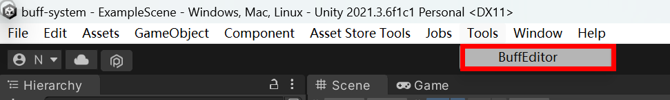
点击后打开Buff编辑器窗口，同时生成文件夹BuffSystem/Data/BuffData。BuffData文件夹保存了你配置的Buff数据，请不要修改其中资产的文件名，也不要改动他们的路径。
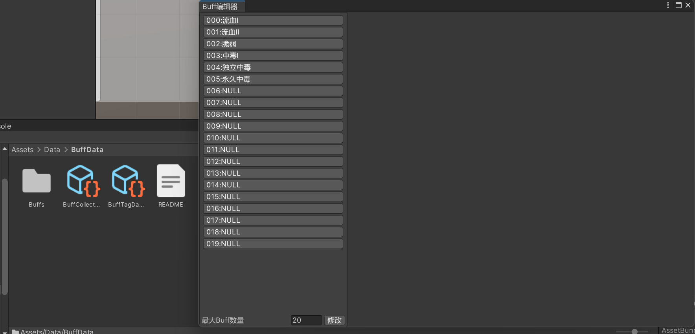
### 编写自定义Buff
创建任意名称的新Buff脚本，引用命名空间NoSLoofah.BuffSystem，让该类继承Buff。实现抽象类后的格式如下：
```csharp
using UnityEngine;
using NoSLoofah.BuffSystem;
public class Buff_XXX : Buff
{
    public override void OnBuffAwake()
    {
        base.OnBuffAwake();
    }
    public override void OnBuffDestroy(){}
    public override void OnBuffModifyLayer(int change){}
    public override void OnBuffRemove(){}
    public override void OnBuffStart(){}
    public override void Reset(){}
    protected override void OnBuffTickEffect(){}
}
```
请在对应的函数里实现需要的功能。
Buff的生命周期如下：
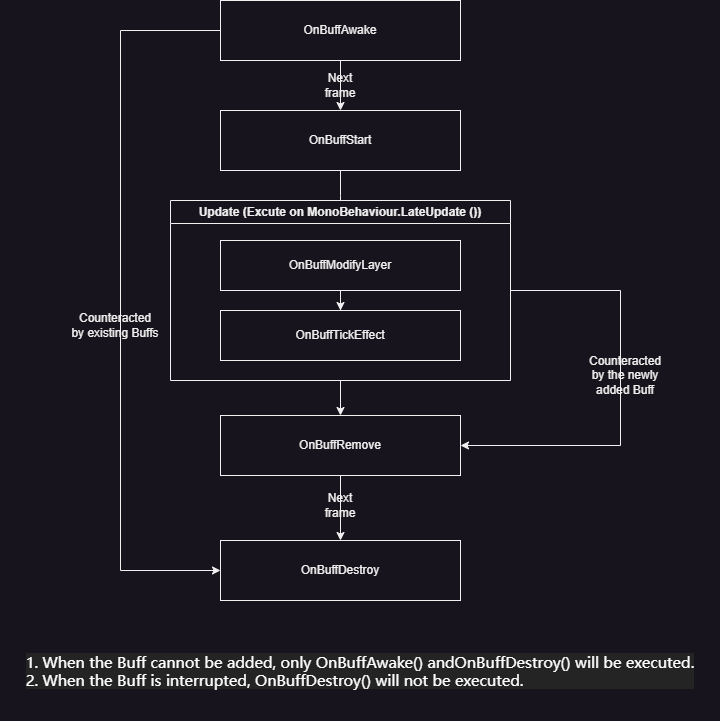
1. **如果一个Buff没有因为Tag或其他原因被打断，那么它的生命周期是**：
    1. 在被添加的那一帧执行**OnBuffAwake**
    2. 下一帧执行**OnBuffStart**
    3. 在执行**OnBuffStart**的同一帧及此后的每一帧执行**OnBuffUpdate**。**OnBuffUpdate**内调用了两个生命周期函数，依次是**OnBuffModifyLayer**和**OnBuffTickEffect**；前者在多层Buff的层数发生变化时执行，后者则执行Buff的周期性效果（如Buff持续期间每1秒损失一点生命）
    4. Buff持续时间结束时，执行**OnBuffRemove**
    5. 下一帧执行**OnBuffDestroy**，完成Buff的移除

> 注意：Buff执行的第一个Update会通过OnBuffModifyLayer将自己的层数从0提升为1，而OnBuffDestroy会将层数重置为0并F最后执行一次OnBuffModifyLayer

2. **编写自定义Buff的逻辑时，你可能会用到这些成员：**
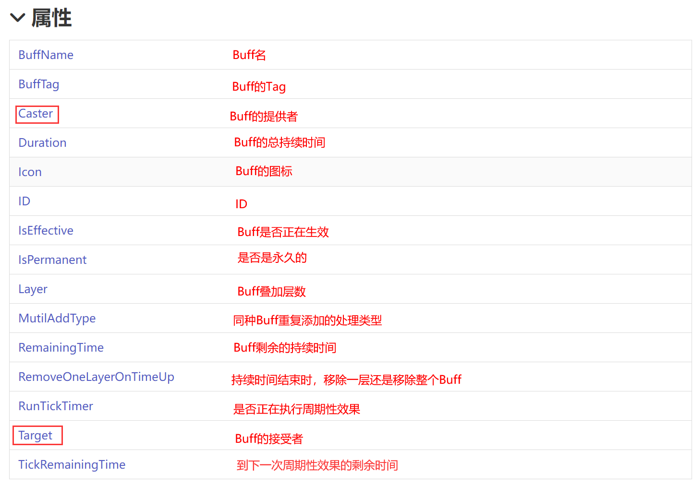
3. **开启周期性效果的函数是StartBuffTickEffect(float interval)，停止周期性效果的函数是StopBuffTickEffect()**。如果周期性效果在Buff刚被添加时就开始计时，你可以在**OnBuffStart**里调用它；当然你也可以其他生命周期函数中调用。
4. **你可以给Buff添加新的成员字段。** 如果你希望在编辑器里配置这些字段，我建议用 **[SerializeField] private**来修饰他们。

一个简单的中毒Buff可以这样实现：
```csharp
using UnityEngine;
using NoSLoofah.BuffSystem;
public class Buff_Poison : Buff
{
    [SerializeField] private int poisonDamage;
    [SerializeField] private float poisonTimeInterval;
    [SerializeField] private GameObject effect;
    private Entity1 targetEntity;
    public override void OnBuffDestroy() { base.OnBuffDestroy(); }

    public override void OnBuffModifyLayer(int change) { }

    public override void OnBuffRemove() { }

    public override void OnBuffStart()
    {
        targetEntity = Target.GetComponent<Entity1>();
        StartBuffTickEffect(poisonTimeInterval);
    }

    public override void Reset() { }

    protected override void OnBuffTickEffect()
    {
        targetEntity.ModifyHealth(-Layer * poisonDamage);
        var g = Instantiate(effect);
        g.transform.position = Target.transform.position;
    }
}
```
Entity1可以换成你自己的业务类

### 配置Buff
打开BuffEditor，可以看到编辑器分为两栏：
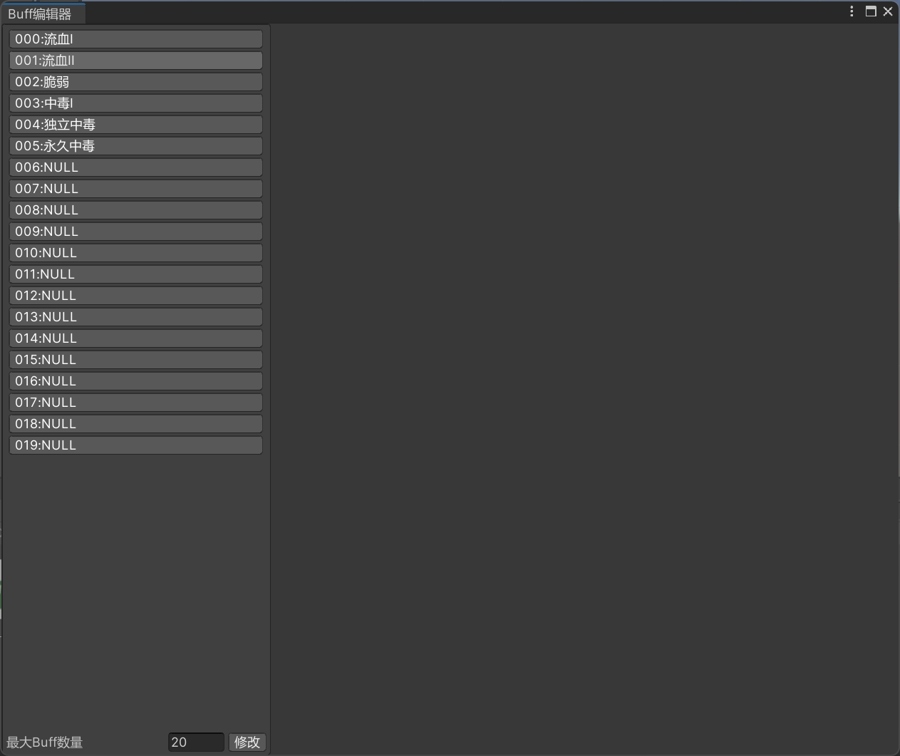
左栏显示项目中你配置好的所有Buff。每一项的冒号左侧是这个Buff的序号，右侧是Buff的名称。**如果Buff没有命名，则会显示为NULL，且系统会将其视为空Buff。配置的Buff是可以重名的，但是名称不能为空**。
> 也许你会好奇如果给Buff起名为NULL会怎么样——
> 实际上不会出现任何Bug，只会让你自己看着犯迷糊

左下角可以修改**最大Buff数量**。如果你将数字改小，那么**序号排最后的Buff数据都会被删除**

现在选中一个空Buff，右栏显示如下：

出现了一个名为类的下拉框，其内容是**Buff的所有子类**。我们在上一步添加的Buff_Poison也自动显示在了上面（图上另外的两个Buff来自项目的示例文件）
**选中Buff_Poison**，我们配置一个新的中毒Buff
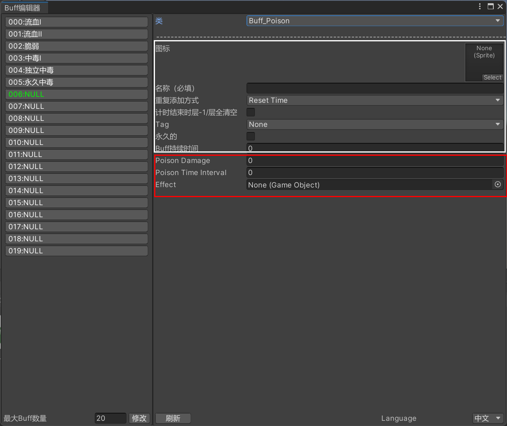
图中白框框住的是Buff类的成员，红框框住的是我们为Buff_Poison添加的独有的成员。下面介绍可以在Buff子类中访问到的成员：
- 图标(Icon)
- 名称(BuffName)
- 重复添加方式(MutilAddType)：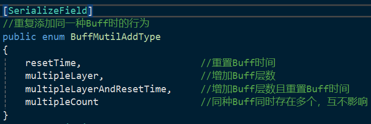
- Tag(BuffTag)：Buff的Tag，处理互斥关系。后文详细解释。
- 永久的(IsPermanent)：在主动去除Buff前永久生效
- Buff持续时间(Duration)：Buff的有效时间。如果Buff是永久的那么这一项无效。

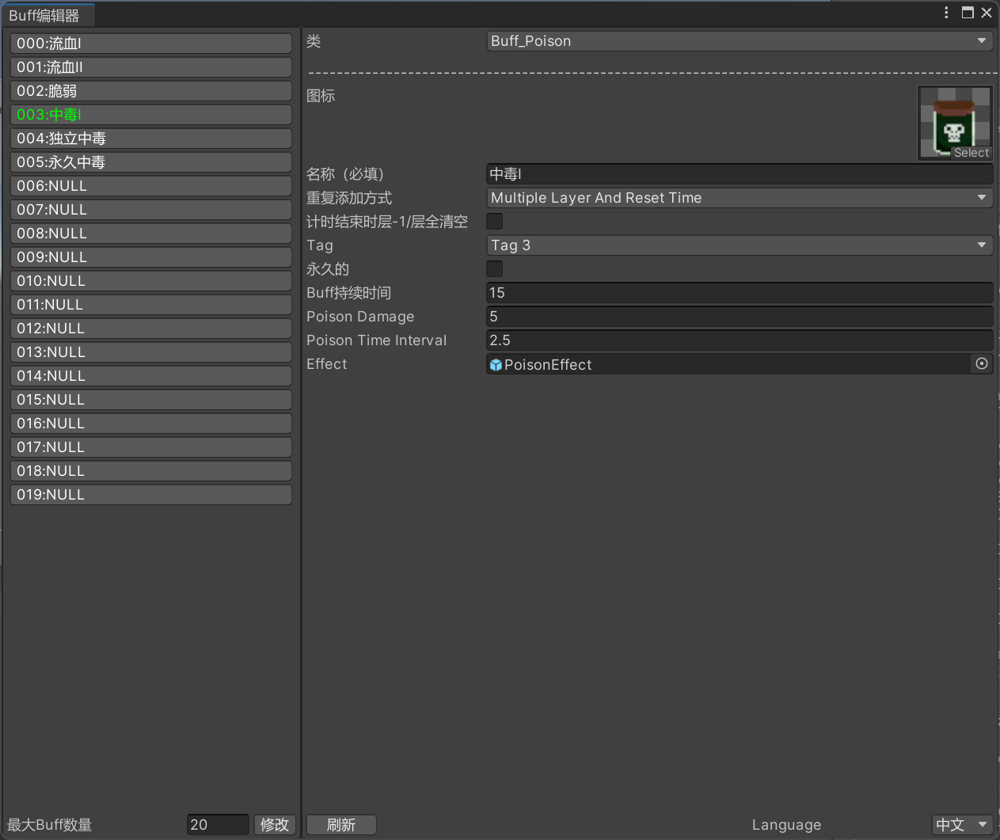

### 配置Tag
**点击BuffSystem/Data/BuffData路径下的BuffTagData.asset**，观察Inspector
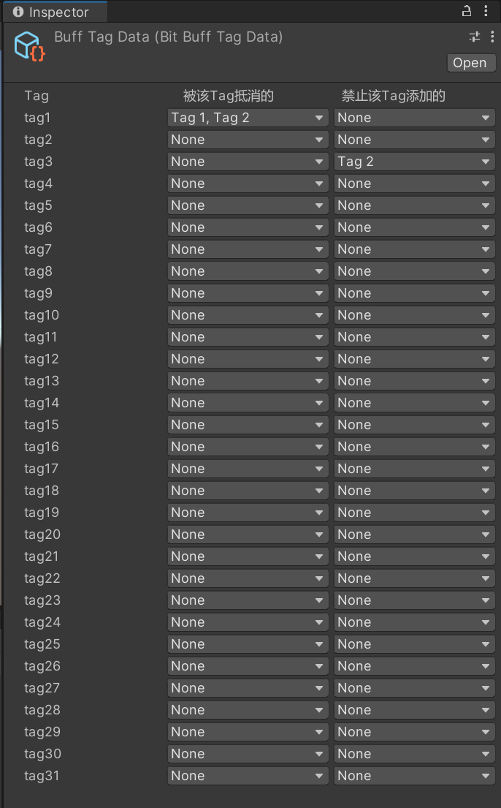
目前Tag的数量是固定的，为**31**个。我们在上一节配置Buff时看到，每个Buff都可以配置**一个Tag**。我们在BuffTagData.asset配置Tag之间的互斥关系
1. 当一个Buff（下文称之为newBuff）添加到一个对象身上时，它的**OnBuffAwake**会立即执行。
2. 之后在同一帧，系统监测该实体身上已有Buff的Tag。以上图为例，如果newBuff的Tag为Tag3，而目标身上已经有Tag为Tag2（禁止该Tag添加的Buff）的其他Buff，那么我们会立即执行newBuff的**OnBuffDestroy**，并不将他添加到实体的Buff列表中。
3. 如果没有其它Buff禁止添加newBuff，接下来会检查是否有可以被newBuff抵消的Buff。以上图为例，如果newBuff的Tag为Tag1，那么目标实体上所有tag为Tag1和Tag2的其他Buff都会被移除（按正常生命周期执行OnBuffRemove和OnBuffInterupt。具体可见“编写自定义Buff”中的生命周期图）

如果你需要修改Tag的名称，请在**BuffSystem/Base/Tag/BuffTag.cs**修改
### 让Buff发挥作用
1. 在游戏场景添加**BuffSystem/Base**路径下的**BuffMgr**预制体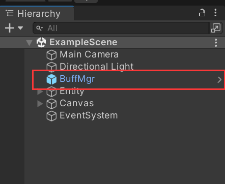
2. 在接受Buff的游戏物体上添加**BuffHandler**组件
3. 在添加Buff的脚本里调用上一步添加的**BuffHandler**。下面是它的接口
```csharp
 public interface IBuffHandler
 {
     /// <summary>
     /// 添加Buff 
     /// </summary>
     /// <param name="buffId">施加Buff的ID</param>
     /// <param name="caster">施加Buff者</param>
     public void AddBuff(int buffId, GameObject caster);
     /// <summary>
     /// 移除Buff
     /// </summary>
     /// <param name="buffId">要移除的Buff id</param>
     /// <param name="removeAll">如果对象同时存在多个同id的buff，是否将所有一并移除</param>
     public void RemoveBuff(int buffId, bool removeAll = true);
     /// <summary>
     /// 移除Buff（不执行OnBuffDestroy）
     /// </summary>
     /// <param name="buffId">要移除的Buff id</param>
     /// <param name="removeAll">如果对象同时存在多个同id的buff，是否将所有一并移除</param>
     public void InteruptBuff(int buffId, bool interuptAll = true);
     /// <summary>
     /// 注册事件：添加Buff时
     /// </summary>
     /// <param name="act"></param>
     public void RegisterOnAddBuff(Action act);
     /// <summary>
     /// 删除事件：添加Buff时
     /// </summary>
     /// <param name="act"></param>
     public void RemoveOnAddBuff(Action act);
     /// <summary>
     /// 注册事件：删除Buff时
     /// </summary>
     /// <param name="act"></param>
     public void RegisterOnRemoveBuff(Action act);
     /// <summary>
     /// 删除事件：删除Buff时
     /// </summary>
     /// <param name="act"></param>
     public void RemoveOnRemoveBuff(Action act);
 }
```
例如，示例项目中通过按钮添加、移除、打断Buff是这样实现的：
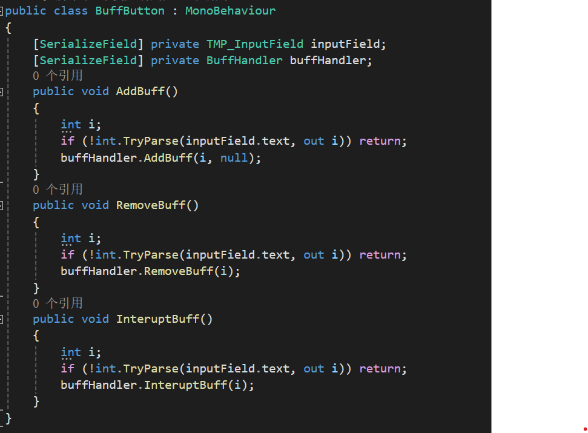
